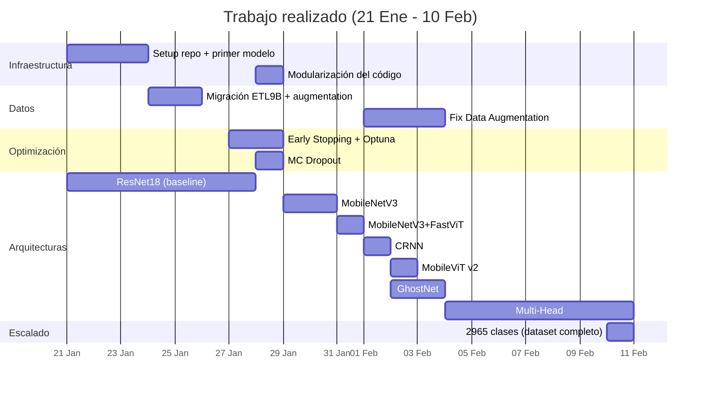

# Resumen de Trabajo Realizado (21 Enero – 10 Febrero 2026)

## Fase 1 — Configuración Inicial y Primer Modelo (21–23 Ene)

**Objetivo**: Establecer la infraestructura del proyecto y entrenar un primer baseline.

| Hito | Detalle |
|:--|:--|
| Estructura del repositorio | Creación de directorios `TRAIN/`, `TESTS/`, `DATA/`, `REFERENCES/`. Configuración de `.gitignore` y reglas de commits. |
| Primer modelo (**resnet18-model-v1**) | ResNet18 sobre ETL9G (2965 clases), 128×128, 30 épocas → **Val Acc: 99.5%**. Convergencia muy rápida. |
| Traducción del notebook a inglés | Para consistencia y acceso internacional. |
| Semilla de reproducibilidad | `RANDOM_SEED = 42` fijada en todo el pipeline. |
| Selección de clases | Implementación de `MAX_CLASSES_LIMIT` para entrenar con subconjuntos más pequeños. |
| Protocolo de log histórico | Creación de `training_log.csv` para registrar todos los experimentos de forma versionada. |
| Directorio de referencias | Carpeta `REFERENCES/` para literatura académica y documento de referencias bibliográficas. |

**Commits destacados**: `ee03cd6`, `81d2140`, `caf610d`, `c96de92`, `3029416`

---

## Fase 2 — Cambio de Dataset y Data Augmentation (24–25 Ene)

**Objetivo**: Migrar al dataset ETL9B (binarizado) y mejorar el aumento de datos.

| Hito | Detalle |
|:--|:--|
| Migración a **ETL9B** | Dataset binarizado, más limpio. Se reduce a **150 clases** para experimentación rápida. |
| Experimento HSK-1 | Prueba con dataset externo de caracteres chinos (HSK-1 de Kaggle) → **Test Acc: 97.82%** con ResNet18. |
| Transformaciones morfológicas | Se añaden `Erode`, `Dilate` y `ElasticTransform` al pipeline de augmentación. |

**Commits destacados**: `01897ed`, `5a361ae`, `021d184`

---

## Fase 3 — Optimización: Early Stopping, Scheduler, Optuna y MC Dropout (27–28 Ene)

**Objetivo**: Mejorar el entrenamiento con técnicas de optimización automática y añadir estimación de incertidumbre.

| Hito | Detalle |
|:--|:--|
| **Early Stopping + ReduceLROnPlateau** | Implementados para evitar sobreentrenamiento y ajustar la tasa de aprendizaje dinámicamente. Modelo **resnet18-v3** → **Val: 97.74%, Test: 98.14%**. |
| **Integración de Optuna** | Búsqueda automática de hiperparámetros (LR, batch size, optimizer). Usa solo un **2%** de las clases para acelerar la búsqueda. Modelo **resnet18-v4** → **Val: 91.14%, Test: 90.81%** (peor resultado, posible sobreajuste del espacio de búsqueda). |
| **Monte Carlo Dropout** | Implementado en las funciones de inferencia (`predict_and_evaluate`) para estimar la **incertidumbre predictiva**. Se ejecutan múltiples pasadas forward con dropout activo (`enable_dropout` helper), calculando media y varianza de las predicciones. Se usa tanto en test como en evaluaciones CASIA. *(Commits `5def312`, `c9f8aa5`, `95527a1`)* |
| **Sistema de Checkpoints** | Guardado automático de `last_checkpoint.pth` en cada época (estado completo: modelo, optimizador, época, scheduler). Permite **reanudar entrenamientos** interrumpidos sin perder progreso — especialmente útil para entrenamientos largos en Kaggle. *(Commit `c9f8aa5`)* |

**Commits destacados**: `91dfe7e`, `8d75fff`, `5def312`, `c9f8aa5`, `bc87be5`

---

## Fase 4 — Modularización del Código (28 Ene)

**Objetivo**: Refactorizar el notebook monolítico en módulos Python independientes.

Se creó la carpeta `TRAIN/modules/` con los siguientes componentes:

| Módulo | Responsabilidad |
|:--|:--|
| [config.py](../TRAIN/modules/config.py) | Hiperparámetros, rutas, flags (Kaggle/local, Optuna on/off) |
| [dataset.py](../TRAIN/modules/dataset.py) | Gestión del dataset ETL9B y carga de datos |
| [models.py](../TRAIN/modules/models.py) | Definición de arquitecturas (MobileNetV3, GhostNet Multi-Head) |
| [train_model.py](../TRAIN/modules/train_model.py) | Bucle de entrenamiento con checkpoints |
| [evaluation.py](../TRAIN/modules/evaluation.py) | Evaluación con MC Dropout y métricas |
| [optuna.py](../TRAIN/modules/optuna.py) | Optimización de hiperparámetros |
| [transforms.py](../TRAIN/modules/transforms.py) | Transformaciones de Data Augmentation |

**Beneficios**: Reutilización entre experimentos, mantenibilidad, testing unitario, separación de responsabilidades.

**Commit destacado**: `f8d4367`

---

## Fase 5 — Exploración de Arquitecturas Ligeras (29 Ene – 2 Feb)

**Objetivo**: Evaluar diferentes arquitecturas eficientes para dispositivos móviles.

### Arquitecturas probadas y resultados

| ID | Arquitectura | Test Acc | Top-5 Test | CASIA Top-5 | Observaciones |
|:--|:--|:--|:--|:--|:--|
| mobilenet_v3-v1 | MobileNetV3 | 97.01% | 99.83% | 83.91% | Primera prueba con arquitectura ligera |
| mobilenet_v3-v2 | MobileNetV3 (frozen) | 23.02% | 51.94% | 19.21% | ⚠️ Fallo: congelar capas causó colapso |
| fastvit-v1 | MobileNetV3+FastViT | 94.63% | 99.20% | 70.15% | Híbrido con atención (FastViT) |
| fastvit-v2 | MobileNetV3+FastViT | 94.39% | 99.70% | 51.26% | 50 épocas, curvas más estables |
| crnn-v1 | CRNN (CNN+RNN) | 53.17% | 84.54% | 42.65% | Arquitectura de Kaggle replicada |
| crnn-v2 | CRNN (CNN+RNN) | 87.60% | 98.01% | 81.29% | Mejora significativa con ajustes |
| mobilevitv2-v1 | MobileViT v2 (Transformer) | 87.83% | 98.01% | 53.74% | CNN + Transformer |
| ghostnet-v1 | GhostNet | 86.37% | 98.61% | 52.07% | Inicio con GhostNet, overfitting detectado |

### Mejoras de ingeniería durante esta fase

| Mejora | Detalle | Commit |
|:--|:--|:--|
| **Flag `ON_KAGGLE`** | Detección automática del entorno (`/kaggle/input`). Adapta rutas, módulos y recursos para ejecutar en la nube sin modificar código. | `4ef3309` |
| **Flag `OPTUNA_ENABLED`** | Permite saltar la optimización de hiperparámetros en ejecuciones donde se quieren usar parámetros fijos ya encontrados. | `1354155` |
| **Centralización de optimizer/scheduler/loss** | Instanciación de optimizador, scheduler y loss function en una única función (`train_utils.py`) para evitar duplicación y facilitar la recuperación desde checkpoints. | `daf3068` |
| **Fix binarización + histograma** | Se corrigió que las imágenes entraban al modelo en escala de grises (1ch) en vez de binarizadas (3ch) por el orden de las transformaciones. Se añadió un **histograma de distribución de color** en el notebook para verificar visualmente que la distribución de los datos de entrenamiento y los de inferencia son coherentes. | `d5d369f` |
| **MC Dropout en evaluaciones de test** | Se extendió Monte Carlo Dropout a las evaluaciones con el conjunto de test (además de CASIA), obteniendo métricas de incertidumbre también para el test set propio. | `95527a1` |

**Commits destacados**: `80bce4d`, `faea119`, `5f421bb`, `a56f696`, `416f0dc`, `69e9ac7`

---

## Fase 6 — Corrección Crítica de Data Augmentation (1–3 Feb)

> [!IMPORTANT]
> Esta fase resolvió dos bugs críticos que afectaban la calidad de los resultados.

### Bug 1: Función `train_model()` devolvía el modelo incorrecto (Commit `6216312`)
- **Problema**: Se evaluaba el modelo de la **última época** en vez del **mejor modelo** guardado.
- **Consecuencia**: Desviaciones de ±2-4% en test accuracy.
- **Solución**: Cargar automáticamente `best_kanji_model.pth` antes de evaluar.

### Bug 2: Data Augmentation excesiva causaba overfitting (Commit `3444174`)
- **Problema**: Transformaciones como `ColorJitter` y `GaussianNoise` eran incompatibles con imágenes **binarizadas** del ETL9B, generando distribuciones de entrenamiento muy diferentes a las de validación.
- **Consecuencia**: Curvas de validación erráticas y brecha creciente con entrenamiento.
- **Solución**: Eliminación de `ColorJitter` y `GaussianNoise`; ajuste de `ElasticTransform`.

### Impacto post-fix

| Modelo | Test Acc | CASIA Top-5 | Notas |
|:--|:--|:--|:--|
| ghostnet-v2 | **99.64%** | **91.10%** | Primera prueba post-fix. Mejora drástica. |
| mobilenet_v3-v3 | **99.57%** | **89.55%** | Confirmación de la mejora con otra arquitectura. |

---

## Fase 7 — Arquitectura Multi-Head y Escalado (4–10 Feb)

**Objetivo**: Incorporar información sobre componentes/radicales de los kanji y escalar a todas las clases.

### Arquitectura Multi-Head (`MultiHeadKanjiClassificator`)

```
             ┌──────────────┐
  Imagen ──► │   GhostNet   │──► Features (backbone)
             │  (backbone)  │       │
             └──────────────┘       ├──► Component Head ──► Logits de componentes
                                    │         │
                                    └── cat ───┘
                                        │
                                        └──► Kanji Head ──► Logits de clasificación
```

- El **Component Head** clasifica radicales/componentes del kanji.
- El **Kanji Head** recibe las features **concatenadas** con las predicciones de componentes, forzando al modelo a aprender estructura interna.

### Evolución de resultados con Multi-Head

| ID | Arquitectura | Clases | Test Acc | Top-5 Test | CASIA Top-5 |
|:--|:--|:--|:--|:--|:--|
| mobilenet_v3-v4 | MobileNetV3 (Multi-Head) | 150 | 99.57% | 100.00% | 92.61% |
| ghostnet-v3 | GhostNet (Multi-Head) | 150 | **99.73%** | 100.00% | **93.50%** |
| **ghostnet-v4** | **GhostNet (Multi-Head)** | **2965** | **99.54%** | **99.97%** | **82.91%** |

> [!TIP]
> El modelo **ghostnet-v4** es el primer experimento con las **2965 clases** del ETL9B, manteniendo 99.54% de accuracy.

**Commits destacados**: `27001c5`, `ccddafe`, `c754ad4`, `b64f183`

---

## Resumen Cronológico de Hitos



---

## Tabla Resumen: Evolución de Métricas

| # | Modelo | Fecha | Test Acc | CASIA Top-5 | Cambio clave |
|:--|:--|:--|:--|:--|:--|
| 1 | resnet18-v1 | 21 Ene | N/A | N/A | Baseline ETL9G |
| 2 | resnet18-v2 | 27 Ene | 98.08% | 87.66% | ETL9B + DA completa |
| 3 | resnet18-v3 | 27 Ene | 98.14% | 93.43% | + Early Stopping + Scheduler |
| 4 | resnet18-v4 | 28 Ene | 90.81% | 53.91% | + Optuna (resultado pobre) |
| 5 | mobilenet_v3-v1 | 29 Ene | 97.01% | 83.91% | Cambio a arq. ligera |
| 6 | fastvit-v1 | 31 Ene | 94.63% | 70.15% | Híbrido CNN+Atención |
| 7 | crnn-v2 | 1 Feb | 87.60% | 81.29% | Arquitectura recurrente |
| 8 | ghostnet-v2 | 3 Feb | **99.64%** | **91.10%** | **Post-fix DA** |
| 9 | mobilenet_v3-v3 | 4 Feb | 99.57% | 89.55% | Confirmación post-fix |
| 10 | ghostnet-v3 | 6 Feb | **99.73%** | **93.50%** | Multi-Head + GhostNet |
| 11 | **ghostnet-v4** | **10 Feb** | **99.54%** | **82.91%** | **2965 clases completas** |
